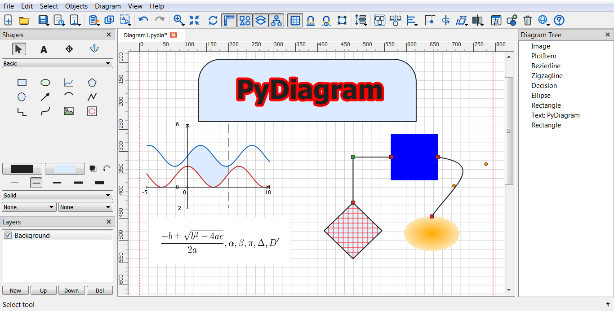

# PyDiagram

A Dia-inspired 2D diagram editor written in Python and PyQt5. Draw flowcharts, UML and general-purpose diagrams, connect shapes with lines that follow them around, organize the drawing into layers, and export it to PNG, SVG, PDF or TikZ.

The interface and the built-in help are available in **English, French and Arabic** (Arabic is displayed right-to-left).

## Features

- **Toolbox** with Basic, Flowchart, UML and Assorted shape categories, plus your own categories of saved custom shapes.
- **Connections**: lines attach to connection points and stay attached when shapes move; the Anchor tool adds your own connection points.
- **Colors**: every fill/border color can be a solid color, a two-color gradient (linear or radial) or a repeating pattern.
- **Editing**: multiple diagrams in tabs (each with its own undo history and layers), grouping, alignment, rotate/flip/scale, clone and duplicate, and a Diagram Tree panel.
- **Page setup**: paper sizes A0-A10, B0-B10 or a custom size, portrait or landscape, grid, snapping and rulers.
- **LaTeX equations** inserted as images (see [Requirements](#requirements)).
- **Export**: PNG, SVG, multi-page PDF and TikZ.
- **PDF links**: a shape can link to another diagram; in the exported PDF it becomes a clickable jump to that diagram's page.
- **Help** (`F1`) in three languages, always matching the language the interface is currently set to.

## Requirements

- Python 3
- PyQt5 (including `PyQt5.QtSvg`)
- `pypdf` - used to add the internal links to exported PDFs (`pip install pypdf`)
- Optional, for **Create from LaTeX...**: install either [MiKTeX](https://miktex.org) or [TeX Live](https://www.tug.org/texlive/). The renderer runs `pdflatex` and `pdftocairo` (part of Poppler), and both must be on the system `PATH`; if `pdftocairo` is not included with your LaTeX distribution, install Poppler as well.

## Running from source

```text
pip install PyQt5 pypdf
python main.py
```

## Building the Windows program and installer

1. Install PyInstaller in the same environment as PyQt5 and `pypdf`, then run `PyDiagram.bat`. It produces `dist\PyDiagram\PyDiagram.exe` and bundles the whole `help` folder (all languages and images).
2. Open `PyDiagram.iss` in Inno Setup and compile it to produce the installer.

## Screenshot




## Help

`F1` (or the Help button) opens the help in the interface's current language, not the operating system's. The pages live in one folder per language, all with the same file names, and share the screenshots in `help/images`:

```text
help/
    en/   fr/   ar/      16 pages each: index.html, saving.html, ...
    images/
```

To add another language, create `help/<code>/` with the same pages, add the code to `AVAILABLE_LANGUAGES` in `app/help_dialog.py`, and add the language to `app/translations.py`. Right-to-left languages are detected automatically; their pages should mark blocks with `dir="rtl"`, because Qt's help browser does not inherit text direction from the page or the dialog.

## Keyboard shortcuts

The complete list is in the Help (Keyboard shortcuts). The ones most likely to be looked for:

| Shortcut | Action |
| --- | --- |
| `Ctrl+B` | Clone (opens a copy of the diagram in a new tab) |
| `Ctrl+D` | Duplicate the selection |
| `Ctrl+Shift+B` / `Ctrl+Shift+F` | Send to Back / Bring to Front |
| `Ctrl+F` | Best Fit (zoom to show the whole diagram) |
| `F5` | Refresh |
| `F6` / `F7` / `F8` / `F9` / `F10` | Rulers / Shapes / Layers / Tools / Diagram Tree |
| `F1` | Help |

## PDF links

1. Open a shape's Properties (Ctrl+click it, or select it and press `Alt+Enter`; for Text, right-click and choose Properties).
2. Choose another open diagram in **PDF Link**.
3. Use **File > Export to PDF...** with the destination diagram checked. Each linked shape becomes a clickable area that jumps to the destination's page.

A link stores the destination's persistent document ID, not a page number, so reordering the pages in the export dialog never breaks it. If the destination is missing from the export, the export stops with a message. Save the destination diagram too, so its ID is stored in its own file.

## Project layout

```text
main.py            entry point
app/               main window, dialogs, translations (en/fr/ar), settings, export code
canvas/            scene, view, tools, layers, rulers, undo commands
items/             shapes and their property dialogs
help/              built-in help: en/, fr/, ar/ and images/
PyDiagram.bat      PyInstaller build (Windows)
PyDiagram.iss      Inno Setup installer script
```

## License

PyDiagram is free software, released under the GNU General Public License, version 3 or later. See `license.txt`.

---

# Original design notes

The notes below are the original roadmap the project was started from. They describe the intended architecture, not the current state of the code.

Yes. If your goal is to build a **Dia-like desktop diagram editor in PyQt5**, I would not try to clone all of Dia at once. Build the diagram engine first, then progressively add palettes, connectors, serialization, export, and specialized diagram types.

Dia is essentially a structured diagram editor: users place objects on a canvas, resize/move them, connect objects with lines, organize them into layers, customize properties, and export diagrams to formats such as SVG, PDF and PNG. ([DIA Installer][1])

The good news is that **PyQt5's `QGraphicsScene` + `QGraphicsView` + custom `QGraphicsItem` classes are a very good foundation for this type of application**. Qt's Graphics View framework is specifically designed for interactive 2D scenes, selection, mouse interaction, transformations, grouping and rendering. ([QTHub][2])

## 1. Target architecture

I would structure the application like this:

```text
                    Diagram Editor
                         │
        ┌────────────────┼────────────────┐
        │                │                │
    Main Window       Diagram Model    Settings
        │                │
 ┌──────┼───────┐       │
 │      │       │       │
Toolbox Canvas  Properties
 │       │
 │   QGraphicsView
 │       │
 │  QGraphicsScene
 │       │
 └── Shapes / Connectors
```

A good project structure:

```text
diagram_editor/
│
├── main.py
│
├── app/
│   ├── main_window.py
│   ├── actions.py
│   ├── menus.py
│   └── settings.py
│
├── canvas/
│   ├── diagram_scene.py
│   ├── diagram_view.py
│   ├── selection.py
│   └── grid.py
│
├── items/
│   ├── base_item.py
│   ├── rectangle.py
│   ├── ellipse.py
│   ├── polygon.py
│   ├── text.py
│   ├── image.py
│   └── connector.py
│
├── tools/
│   ├── select_tool.py
│   ├── rectangle_tool.py
│   ├── connector_tool.py
│   ├── text_tool.py
│   └── zoom_tool.py
│
├── model/
│   ├── diagram.py
│   ├── layer.py
│   ├── object.py
│   └── connection.py
│
├── commands/
│   ├── add_command.py
│   ├── delete_command.py
│   ├── move_command.py
│   ├── resize_command.py
│   └── command_stack.py
│
├── io/
│   ├── serializer.py
│   ├── json_format.py
│   ├── svg_export.py
│   ├── tikz_export.py
│   ├── png_export.py
│   └── pdf_export.py
│
├── palettes/
│   ├── basic.py
│   ├── flowchart.py
│   ├── uml.py
│   ├── network.py
│   └── er.py
│
└── resources/
    ├── icons/
    └── shapes/
```

The important architectural decision is:

> **Do not make the `QGraphicsItem` itself your entire application model.**

Separate the **diagram data model** from the **visual representation**.

---

# 2. Phase 1 — Build the canvas

Start with:

* `QMainWindow`
* toolbar
* menu
* toolbox
* `QGraphicsScene`
* `QGraphicsView`

Your initial UI should look roughly like:

```text
┌──────────────────────────────────────────────────────────┐
│ File Edit View Diagram Object Help                       │
├──────────────────────────────────────────────────────────┤
│  Select  Line  Rectangle  Ellipse  Text  Zoom           │
├──────────────┬───────────────────────────────────────────┤
│              │                                           │
│  Toolbox     │                                           │
│              │                                           │
│  Basic       │             Diagram Canvas               │
│  Shapes      │                                           │
│              │          ┌───────────┐                    │
│  Flowchart   │          │           │                    │
│              │          └───────────┘                    │
│  UML         │                 │                         │
│              │                 │                         │
│  Network     │          ┌───────────┐                    │
│              │          │           │                    │
│              │          └───────────┘                    │
└──────────────┴───────────────────────────────────────────┘
```

This corresponds closely to Dia's toolbox + canvas concept. ([DIA Installer][3])

Use:

```python
QGraphicsScene
QGraphicsView
QGraphicsItem
QGraphicsRectItem
QGraphicsEllipseItem
QGraphicsPathItem
QGraphicsTextItem
```

as the foundation.

---

# 3. Phase 2 — Implement basic objects

Don't start with UML or networking.

Start with only:

### Basic shapes

* Rectangle
* Rounded rectangle
* Ellipse
* Polygon
* Line
* Arc
* Text
* Image

Create a common base class:

```python
class DiagramItem(QGraphicsItem):
    ...
```

It should eventually contain properties such as:

```text
id
x
y
width
height
rotation
z_index
fill_color
border_color
border_width
opacity
line_style
text
font
```

For example:

```text
DiagramItem
    │
    ├── RectangleItem
    ├── EllipseItem
    ├── PolygonItem
    ├── TextItem
    ├── ImageItem
    └── ConnectorItem
```

---

# 4. Phase 3 — Selection and manipulation

This is where the application begins to feel like Dia.

Implement:

### Single selection

Click an object.

### Multi-selection

```text
Ctrl + click
```

### Rubber-band selection

Drag:

```text
┌─────────────────────┐
│     ┌──────────┐    │
│     │ selected │    │
│     └──────────┘    │
└─────────────────────┘
```

### Move

Drag selected objects.

### Resize

Display handles:

```text
●────────────●
│            │
│   object   │
│            │
●────────────●
```

### Rotate

Add a rotation handle later.

### Keyboard

Implement:

```text
Delete       delete
Ctrl+C       copy
Ctrl+V       paste
Ctrl+X       cut
Ctrl+A       select all
Ctrl+Z       undo
Ctrl+Shift+Z redo
Arrow keys   move
```

---

# 5. Phase 4 — Connector system

**This is probably the most important part of the project.**

A diagram editor isn't just a drawing program.

You want:

```text
┌──────────┐
│  Server  │
└────┬─────┘
     │
     │
     ▼
┌──────────┐
│ Database │
└──────────┘
```

If the Server moves, the connector must automatically follow.

Dia explicitly supports connection points and lines that remain attached when objects move. ([DIA Installer][1])

Create:

```text
ConnectionPoint
Connection
Connector
```

For every shape, define connection points:

```text
       top
        ●
        │
left ●──□──● right
        │
        ●
      bottom
```

Then a connector contains:

```python
source_item
source_point
target_item
target_point
```

rather than simply:

```python
x1, y1, x2, y2
```

This distinction will make the rest of the project much easier.

---

# 6. Phase 5 — Smart connectors

Once basic connectors work, add:

### Straight

```text
A ───────── B
```

### Orthogonal

```text
A ──────┐
        │
        └──── B
```

### Polyline

```text
A ────┐
      └────┐
           └── B
```

### Bezier

```text
A ~~~~~~~~~ B
```

And eventually:

* automatic routing
* avoidance of shapes
* arrowheads
* start/end decorations
* line labels

Don't implement automatic routing in version 1.

---

# 7. Phase 6 — Property editor

When an object is selected, display its properties.

For example:

```text
┌───────────────────────┐
│ Properties            │
├───────────────────────┤
│ Position              │
│   X:       120        │
│   Y:       240        │
│                       │
│ Size                  │
│   Width:   160        │
│   Height:   80        │
│                       │
│ Appearance            │
│   Fill:    █████      │
│   Border:  █████      │
│   Width:   2          │
│                       │
│ Text                  │
│   Font:    Arial      │
│   Size:    12         │
└───────────────────────┘
```

This should communicate with the selected `DiagramItem`.

This is also where a clean model/view separation becomes extremely valuable.

---

# 8. Phase 7 — Undo/redo

Do this **earlier than you think**.

Use Qt's:

```python
QUndoStack
QUndoCommand
```

Create commands:

```text
AddItemCommand
DeleteItemCommand
MoveItemCommand
ResizeItemCommand
RotateItemCommand
ChangePropertyCommand
ConnectCommand
DisconnectCommand
GroupCommand
UngroupCommand
```

Then:

```text
Ctrl+Z
     ↓
QUndoStack
     ↓
Command.undo()
```

Don't implement undo by taking screenshots of the scene.

Store actual operations.

---

# 9. Phase 8 — Save/load format

I recommend creating your **own JSON-based format** initially.

Example conceptually:

```json
{
    "version": 1,
    "page": {
        "width": 2100,
        "height": 1500
    },
    "layers": [
        {
            "name": "Layer 1",
            "objects": [
                {
                    "id": "object-001",
                    "type": "rectangle",
                    "x": 100,
                    "y": 200,
                    "width": 200,
                    "height": 100,
                    "fill": "#ffffff",
                    "stroke": "#000000",
                    "text": "Server"
                }
            ]
        }
    ],
    "connections": []
}
```

Your application should have:

```python
DiagramSerializer
```

with:

```python
save(diagram, filename)
load(filename)
```

Eventually you can support a native format such as:

```text
.my_diagram
```

---

# 10. Phase 9 — Layers

Add a layer manager:

```text
Layers
────────────────
☑ Background
☑ Network
☑ Components
☑ Annotations
```

Operations:

```text
New Layer
Delete Layer
Rename
Move Up
Move Down
Lock
Hide
```

Dia itself uses layers to isolate groups of diagram content. ([DIA Installer][1])

---

# 11. Phase 10 — Grid and snapping

Add:

```text
Grid
Snap to grid
Snap to objects
Snap to connection points
Guides
Rulers
```

For example:

```text
Grid = 10 px
```

When moving an object:

```python
x = round(x / grid) * grid
y = round(y / grid) * grid
```

Later add:

```text
┌──────────────┐
│              │
│        ┌─────┼────┐
│        │     │    │
│        └─────┼────┘
│              │
└──────────────┘
```

object-to-object alignment.

---

# 12. Phase 11 — Toolbox / shape palettes

Now start approaching Dia's feature set.

Create categories:

```text
Basic
 ├── Rectangle
 ├── Ellipse
 ├── Polygon
 ├── Line
 ├── Text
 └── Image

Flowchart
 ├── Process
 ├── Decision
 ├── Terminator
 ├── Document
 ├── Database
 └── Connector

UML
 ├── Class
 ├── Interface
 ├── Package
 ├── Actor
 ├── Use Case
 └── Component

Network
 ├── Computer
 ├── Server
 ├── Router
 ├── Switch
 ├── Firewall
 └── Cloud

ER
 ├── Entity
 ├── Attribute
 └── Relationship
```

Dia has many specialized object categories including flowcharts, UML, network diagrams and ER diagrams. ([DIA Installer][1])

---

# 13. Make shapes data-driven

This is an important design improvement.

Don't hard-code every palette button.

Create something like:

```python
ShapeDefinition(
    name="Server",
    category="Network",
    icon="server.png",
    item_class=ServerItem
)
```

Then:

```text
Shape Registry
      │
      ├── Basic
      ├── Flowchart
      ├── UML
      ├── Network
      └── ER
```

The toolbox reads the registry dynamically.

That means adding a new shape becomes:

```text
create shape class
        ↓
register shape
        ↓
appears in toolbox
```

instead of modifying 10 different files.

---

# 14. Export

After the native editor works, implement:

### PNG

Render the scene to:

```python
QImage
```

### SVG

Create vector output.

### PDF

Qt's printing/rendering APIs can be used for PDF/printing; Graphics View provides scene rendering specifically for this sort of operation. ([Documentation Qt][4])

Eventually:

```text
File
 ├── Save
 ├── Save As
 ├── Export PNG
 ├── Export SVG
 ├── Export PDF
 └── Print
```

Dia itself supports several export formats including PNG, SVG and PDF. ([DIA Installer][1])

---

# 15. Page system

Then add actual document/page concepts:

```text
A4
A3
Letter
Custom
```

Orientation:

```text
Portrait
Landscape
```

And:

```text
Margins
Page border
Background
Multiple pages
```

---

# 16. Text engine

Text deserves its own subsystem.

Support:

```text
font
size
bold
italic
underline
alignment
color
line spacing
```

Eventually:

```text
┌────────────────────────┐
│      My Server         │
│                        │
│ CPU: 16 cores          │
│ RAM: 64 GB             │
└────────────────────────┘
```

with editable text.

---

# 17. Grouping

Implement:

```text
Ctrl+G       Group
Ctrl+Shift+G Ungroup
```

For example:

```text
       ┌───────────────────────┐
       │       Server          │
       │                       │
       │   ┌─────┐   ┌─────┐   │
       │   │ CPU │   │ RAM │   │
       │   └─────┘   └─────┘   │
       └───────────────────────┘
```

A group should behave as one object while preserving its children.

---

# 18. Copy/paste and clipboard

Support:

```text
Ctrl+C
Ctrl+V
Ctrl+X
Ctrl+D
```

For copying, serialize the selected objects into an internal clipboard representation.

This is another reason to have a proper model separate from the graphics items.

---

# 19. Multi-document interface

Eventually:

```text
┌─────────────────────────────────────────────┐
│ diagram1     diagram2     diagram3         │
├─────────────────────────────────────────────┤
│                                             │
│                 Canvas                      │
│                                             │
└─────────────────────────────────────────────┘
```

Use tabs with:

```python
QTabWidget
```

Each tab owns:

```text
DiagramDocument
    ├── DiagramModel
    ├── QGraphicsScene
    ├── QGraphicsView
    ├── QUndoStack
    └── filename
```

---

# 20. Suggested development order

I would implement the project in these milestones.

### MVP

**Milestone 1**

```text
QMainWindow
QGraphicsView
QGraphicsScene
```

**Milestone 2**

```text
Rectangle
Ellipse
Line
Text
```

**Milestone 3**

```text
Select
Move
Resize
Delete
Multi-select
```

**Milestone 4**

```text
Connectors
Connection points
Automatic connector updates
```

**Milestone 5**

```text
Save
Load
JSON format
```

**Milestone 6**

```text
Undo
Redo
Copy
Paste
```

At this point you already have a usable diagram editor.

---

# 21. Version 2

Then add:

```text
Grid
Snap
Layers
Properties panel
Grouping
Rotation
Page settings
PNG export
SVG export
PDF export
```

---

# 22. Version 3

Then:

```text
Flowchart shapes
UML
ER
Network
BPMN
Mind-map shapes
Custom shapes
Shape library
```

---

# 23. Version 4

Finally:

```text
Smart routing
Auto-layout
Alignment tools
Distribution tools
Guides
Rulers
Themes
Plugins
Internationalization
Multiple documents
Templates
Advanced printing
```

---

# 24. The most important classes

If I were starting this project today, I'd make these classes first:

```text
MainWindow
    │
    ├── ToolboxWidget
    ├── PropertiesWidget
    ├── LayersWidget
    └── DiagramView
             │
             └── DiagramScene
                    │
                    ├── RectangleItem
                    ├── EllipseItem
                    ├── TextItem
                    ├── ConnectorItem
                    └── ...
```

And underneath:

```text
DiagramDocument
       │
       ├── DiagramModel
       ├── Layer
       ├── DiagramObject
       └── Connection
```

With:

```text
CommandManager
ShapeRegistry
Serializer
Exporter
```

as independent services.

---

# 25. One architectural rule I'd strongly recommend

Don't write this:

```python
class RectangleItem(QGraphicsRectItem):
    # 2,000 lines
```

where the item handles:

* rendering
* persistence
* undo
* selection
* clipboard
* business logic
* connectors
* serialization
* properties

Instead:

```text
DiagramObject
     │
     ├── data/state
     │
     └── RectangleItem
             │
             └── visualization
```

Think:

```text
MODEL                    VIEW

DiagramObject  <------>  QGraphicsItem
     │                         │
     │                         │
 serialization              painting
 properties                 mouse events
 connections                selection
```

That will make the project dramatically easier to maintain.

---

## Recommended technology stack

For your specific project:

| Component     | Technology               |
| ------------- | ------------------------ |
| Language      | Python 3                 |
| GUI           | PyQt5                    |
| Canvas        | `QGraphicsScene`         |
| View          | `QGraphicsView`          |
| Shapes        | Custom `QGraphicsItem`   |
| Undo/Redo     | `QUndoStack`             |
| Settings      | `QSettings`              |
| Native format | JSON initially           |
| Images        | Qt image classes         |
| PNG           | Qt rendering             |
| PDF           | Qt printing/rendering    |
| SVG           | Qt SVG / custom exporter |
| Packaging     | PyInstaller              |
| Testing       | pytest                   |
| Icons         | SVG/PNG                  |

The Qt Graphics View architecture is particularly appropriate here because it provides item selection, event handling, transformations, grouping, collision detection, rendering and support for large scenes. ([Documentation Qt][4])

## The first thing I would actually build

Don't start with the entire application.

Build this tiny prototype first:

```text
                  Diagram Editor

┌─────────────────────────────────────────────┐
│ Select | Rectangle | Ellipse | Line | Text │
├──────────────┬──────────────────────────────┤
│              │                              │
│   Shapes     │                              │
│              │          ┌─────────┐         │
│ Rectangle    │          │ Server  │         │
│ Ellipse      │          └────┬────┘         │
│ Line         │               │              │
│ Text         │               │              │
│              │          ┌────▼────┐         │
│              │          │ Database│         │
│              │          └─────────┘         │
│              │                              │
└──────────────┴──────────────────────────────┘
```

Get **drag → select → resize → connect → move connected object → save → load → undo** working perfectly.

Once those pieces work, adding 100 different Dia-style shapes becomes comparatively straightforward.

If you want to proceed systematically, the **next useful step is to design the actual PyQt5 class architecture and implement Milestone 1–3**, including `MainWindow`, `DiagramScene`, `DiagramView`, `DiagramItem`, selection handles, and the first rectangle/ellipse/line tools.

[1]: https://dia-installer.de/doc/en/quickstart-chapter.html"Chapter 2. Quickstart"
[2]: https://qthub.com/static/doc/qt5/qtwidgets/graphicsview.html "Graphics View Framework | Qt Widgets 5.15.1"
[3]: https://dia-installer.de/doc/en/objects-chapter.html "Chapter 4. Objects and the Toolbox"
[4]: https://doc.qt.io/qtforpython-6/overviews/qtwidgets-graphicsview.html "Graphics View Framework - Qt for Python"
